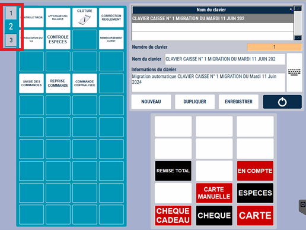
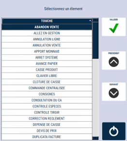
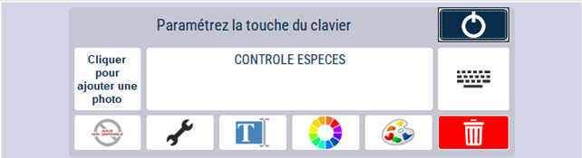
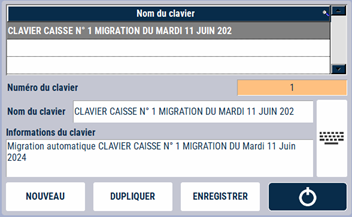

# Mise à jour du clavier caisse/balance

Vous pouvez **personnaliser le clavier caisse/balance** via cette interface.

Vous pouvez modifier les touches des 3 claviers.

<div className="contenaireImg">
    
    </div>

Pour créer une touche, **cliquez sur un emplacement vide**. Une fenêtre apparait, **cliquez sur l’action que vous souhaitez ajouter à la touche**. 

<div className="contenaireImg">
    
    </div>

Pour modifier une touche, **appuyez sur la touche en question**. Cette fenêtre apparait : 

<div className="contenaireImg">
    
    </div>

Vous pouvez alors : 

|Bouton |Action |
|:--:|------|
|  | Changer **l’intitulé** de la fonctionnalité. ```Attention``` : Les fonctionnalités des touches et leurs libellés sont conformes aux diverses règlementations. **Toute modification du libellé de votre part relève de votre responsabilité.** |
|  | Ajouter une **photo** sur la touche. |
|  | **Modifier la fonctionnalité** de la touche. |
|  | **Valider la modification** du texte. |
|  | Modifier la **couleur du texte**. |
|  |  Modifier la **couleur du fond**. |
|  | **Supprimer la fonctionnalité** de la touche. |

Vous pouvez **créer et personnaliser divers modèles de clavier**. 

<div className="contenaireImg">
    
    </div>

:::warning
Pensez à enregistrer vos modifications !
:::