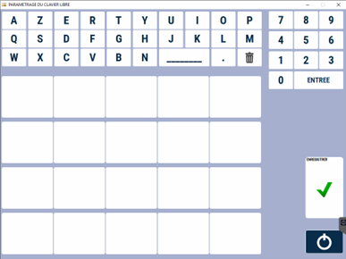
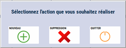
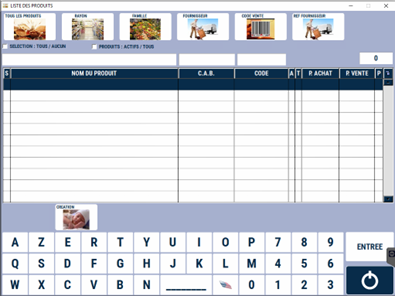
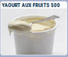
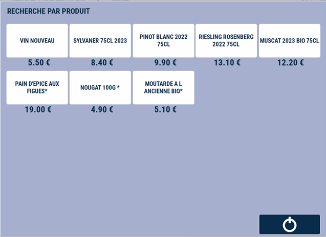

# Mise à jour du clavier libre

Cette fenêtre vous permet de modifier les produits du clavier « **Produits Divers** » que vous avez en caisse (selon paramétrage). Ce clavier permet **l’accès direct à 20 produits** (les prix s’affichent). 

<div className="contenaireImg">
    
    </div>

Pour créer une nouvelle touche, **cliquez sur un emplacement libre**, puis sur ```NOUVEAU```. 

<div className="contenaireImg">
    
    </div>

Choisissez ensuite le produit que vous souhaitez. 

<div className="contenaireImg">
    
    </div>

Une fois le produit sélectionné, vous pouvez **choisir d’associer une photo à la touche**. 

La touche du clavier libre est alors créée. 

<div className="contenaireImg">
    
    </div>

Pour supprimer une touche, **appuyez sur la touche à supprimer**, et cliquez sur ```SUPPRESSION```. 

:::warning
Pensez à enregistrer vos modifications !
:::

En caisse, le clavier libre se présente de la manière suivante, avec les prix affichés :

<div className="contenaireImg">
    
    </div>