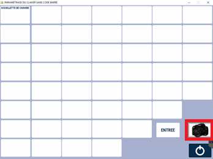
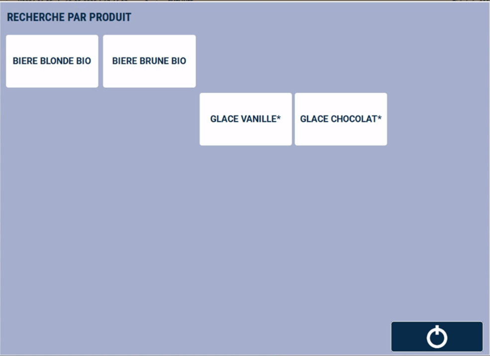
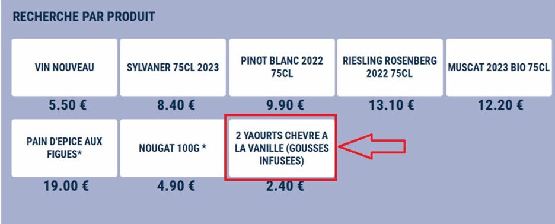

# Mise à jour du clavier sans CAB

Cette fenêtre vous permet de modifier les produits du clavier « **Produits sans CAB** », qui permet **l’accès direct à 50 produits** (ici les prix n’apparaissent pas).

Pour créer une nouvelle touche, **cliquez sur un emplacement libre**, puis sur ```NOUVEAU```. 

<div className="contenaireImg">
    
    </div>

Vous pouvez alors choisir votre produit, en recherchant dans tous les produits, ou par rayon, par famille, par fournisseur, etc. 

<div className="contenaireImg">
    
    </div>

Le produit sélectionné s’affiche alors, et vous pouvez y **associer une photo**. 

<div className="contenaireImg">
    
    </div>

Pour supprimer une touche, **appuyez sur la touche à supprimer**, et cliquez sur ```SUPPRESSION```. 

:::warning
Pensez à enregistrer vos modifications !
:::

En caisse, le clavier des produits sans CAB se présente de la manière suivante, les prix n’étant pas affichés :

<div className="contenaireImg">
    
    </div>

:::note
Sur le clavier libre et le clavier sans CAB, il est possible de **modifier le libellé d’une touche lors de l’ajout ou de la modification** d’une touche auxdits claviers. 
:::

Cependant, **cette modification n’est pas reprise en caisse**, seul le nom du produit tel qu’il est renseigné dans la fiche produit s’affiche. Il n’est donc pas utile de modifier le libellé lors de l’ajout d’une touche.

Par ailleurs, si le libellé d’un produit est long, le logiciel affichera le libellé produit **automatiquement sur plusieurs lignes**.

<div className="contenaireImg">
    
    </div>