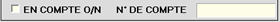

# Mise à jour des clients

Cette fenêtre vous permet de gérer vos clients.

## Page d'accueil de la fiche client

Vous pouvez rechercher un client en saisissant son **nom**, son **code client** ou son **code postal de résidence**. 

Il vous est possible de :

    Effectuer une recherche dans la base client du siège.

    Créer un nouveau client.

    Modifier la fiche du client sélectionné.

La fiche client se compose ainsi : 

    
    

## Détail de la fiche client

### Badge client

    Ce bouton permet d’imprimer un badge client sur une imprimante badge si votre matériel et votre paramétrage le permettent. 

### Coupons 

Vous pouvez consulter les **coupons en cours** générés pour ce client :

    
    

### Informations générales 

Vous pouvez consulter ou modifier les élements suivants :

<li> Le **code ou numéro de client** :il est généré automatiquement par S2Cash à la création du client. Vous avez la possibilité de le **modifier lors de la création du client**, mais il ne pourra plus être changé par la suite. </li>

<li> Les **coordonnées du client**. </li>

    
    

### NPAI

    Cette case permet d’indiquer que le client **ne souhaite pas recevoir d’informations** ou qu’il **n’habite plus à l’adresse indiquée**.

:::note
Selon le paramétrage, S2Cash peut vous **alerter en caisse lors du passage** de ce client, que son adresse n’est pas valable.
:::

### Prix spécifiques 

Vous pouvez attribuer des **prix spécifiques pour certains produits**.

    
    

### Chiffre d'affaires du client

Vous pouvez consulter le **CA mensuel du client**.

    
    

### Informations fidélité 

Vous pouvez : 
<li> Appliquer un **tarif spécifique** pour ce client, </li>
<li> Consulter ou modifier son **solde de points**, le **crédit maximum autorisé** et le **solde actuel de son compte**, </li>
<li> Renseigner un **numéro de badge externe**, si vous ne gérer pas les cartes client avec S2Cash. </li>

    
    

### En compte 

Cochez cette case pour **mettre le client en compte**. Le numéro de compte est automatiquement renseigné par S2Cash, vous avez la possibilité de le modifier.

    
    

### Historique du client 

Ce bouton vous permet d’accéder à l’historique du client.

    
    

