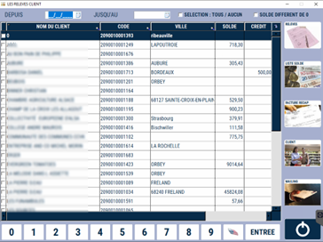

# Relevé des clients

Ce module vous permet d’imprimer un **relevé des ventes pour un client sélectionné sur une période définie**.

    
    

Il vous permet aussi de visualiser et d’imprimer la **liste de vos clients avec leur solde de compte et le montant de crédit autorisé**.

<li> Lorsque le solde est **positif**, le client vous doit de l’argent. </li>
<li> Lorsque le solde est **négatif**, vous devez de l’argent au client. </li>

|Bouton | Action|
|:-------:|-------|
|  | Vous pouvez cocher cette case pour **masquer les clients dont le solde est nul**. |
|  | Vous pouvez accéder **directement à la fiche du client** sélectionné. |
|  | Vous pouvez **générer le relevé client** pour les clients sélectionnés sur la période définie. Le relevé client reprend **chaque transaction détaillée avec son moyen de paiement**. |
|  | Cette touche permet d’imprimer la liste des clients avec leur solde. |
|  | Cette touche permet d’éditer une **facture récapitulative** pour les clients sélectionnés sur la période définie. |
|  | Cette touche permet **d’exporter la base client dans un fichier** que l’on retrouve dans le dossier des ETATS. L’export contient l’intégralité des données clients. |
