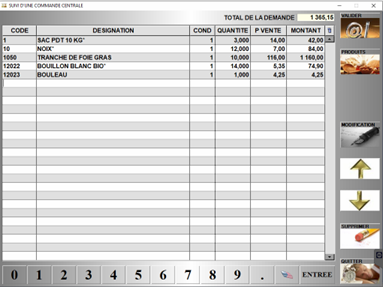

# Les commandes centrales

L’expression de besoins, ou "commande centrale", permet au magasin d’envoyer au siège une demande d’approvisionnement de marchandise. 

Selon le paramétrage, l’accès à l’interface d’expression de besoins diffère :

<li> **Expression par numéro** : Une liste d’expressions de besoin est définie, S2Cash by Atlas vous demande quelle expression de besoin vous souhaitez réaliser. Le tableau s’affiche avec la liste des produits que vous pouvez commander. </li>

<li> **Expression de besoins standard** : Vous arrivez directement sur le tableau vide de saisie de produits à commander. </li>

<div className="contenaireImg">
    
    </div>

Vous pouvez alors : 

|Bouton |Action |
|:--:|------|
|  | **Ajouter un produit à la commande**. Vous pouvez également ajouter un produit en saisissant directement son code dans la colonne CODE. |
|  | Ouvrir la fiche du **produit sélectionné en mode modification**. |
|  | Renseigner votre commande à l’aide d’un **terminal de saisie** (si paramétré). |
|  | **Supprimer** un produit de la commande. |
|  | **Valider** l’expression de besoins. ```Attention``` : Cette opération est **irréversible**. Une fois validée l’expression de besoin est directement transmise au siège. |

Le siège a ainsi la possibilité de **répondre à cette expression de besoins** de différentes manières :

-	Etablir une commande fournisseur pour le compte du magasin, ou de façon centralisée pour l’ensemble ou une partie des magasins ;
-	Livrer le magasin à partir d’un stock siège ou entrepôt (stockage entrepôt ou production interne par exemple) ;
-	Livrer le magasin à partir du stock d’un autre magasin, en réalisant un transfert de stock.

