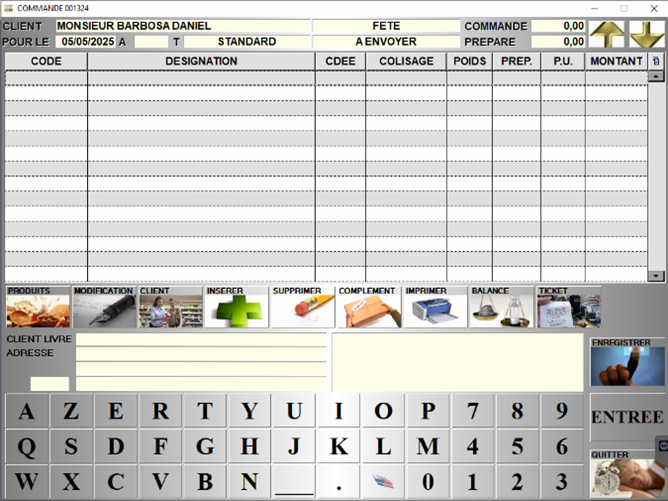
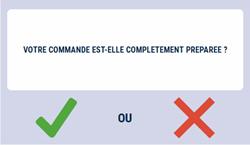

# Les commandes client

Cette fenêtre vous permet de gérer vos commandes client.

Les commandes peuvent être **créées depuis l’interface caisse ou balance** et ensuite être **préparées ou complétées sur la partie gestion**.

Au lancement de la fenêtre, la liste des commandes apparait à l’écran. 

<div className="contenaireImg">
    
    </div>

|Bouton |Action |
|:--:|------|
|  | Créer une commande. |
|  | Modifier une commande. |
|  | Supprimer une commande. |
|  | Préparer une commande en cours. |
|  |Imprimer le détail de la sélection, commande par commande. |
|  | Imprimer le détail regroupé par produits des commandes sélectionnées. |
|  | Regrouper toutes les commandes sur le même affichage. |

## Créer une nouvelle commande client

Lors de la création d’une nouvelle commande, S2Cash vous demande de **sélectionner un client**. 

:::note
Une commande doit impérativement être associée à un client existant.
:::

|Sélectionnez le type de commande |Puis le type de retrait |
|:--:|------|
|  |  |

Vous avez enfin la possibilité de **saisir une date et heure de livraison**, une **adresse** et un **commentaire**.

<div className="contenaireImg">
    
    </div>

:::note
Ces informations sont **facultatives**, vous pouvez cliquer sur enregistrer sans renseigner les zones. Ces informations pourront être **modifiées ultérieurement**.
:::

## Saisir et/ou préparer une commande client

L’interface de saisie et de préparation de commande se présente ainsi :

<div className="contenaireImg">
    
    </div>

Vous pouvez alors : 

|Bouton |Action |
|:--:|------|
|  | Ajouter un produit à la commande. Vous pouvez également ajouter un produit en saisissant directement son code dans la colonne CODE. |
|  | Insérer une ligne vide dans la commande. |
|  | Modifier les informations complémentaires (type de commande ou de retrait, informations sur la livraison…). |
|  | Accéder à la fiche du client. |
|  | Ouvrir la fiche du produit sélectionné en mode modification. |
|  | Lire le ticket d’une balance. |
|  | Lire le ticket d'une caisse. |
|  | Supprimer un produit de la commande. |
|  | Enregistrer la commande en cliquant sur ce bouton, et ainsi pouvoir revenir dessus à tout moment. |
|  | Imprimer la commande. |

## Enregistrer une commande client 

Lorsque vous enregistrez une commande, S2Cash vous demande **si la préparation est terminée**.

<div className="contenaireImg">
    
    </div>

```OUI``` : la commande est complètement préparée, elle pourra donc être reprise dans l’interface caisse/balance via le bouton « Reprise Commande ».

```NON``` : la commande n’est pas complètement préparée, elle est enregistrée en vue de pouvoir revenir dessus et ne peut pas encore être reprise dans l’interface caisse/balance.
