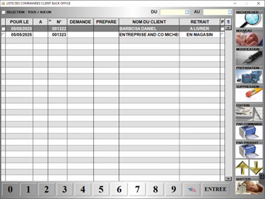

# Les commandes client

Cette fenêtre vous permet de gérer vos commandes client.

Les commandes peuvent être **créées depuis l’interface caisse ou balance** et ensuite être **préparées ou complétées sur la partie gestion**.

Au lancement de la fenêtre, la liste des commandes apparait à l’écran. 

    
    

|Bouton |Action |
|:--:|------|
|  | Créer une commande. |
|  | Modifier une commande. |
|  | Supprimer une commande. |
|  | Préparer une commande en cours. |
|  |Imprimer le détail de la sélection, commande par commande. |
|  | Imprimer le détail regroupé par produits des commandes sélectionnées. |
|  | Regrouper toutes les commandes sur le même affichage. |

## Créer une nouvelle commande client

Lors de la création d’une nouvelle commande, S2Cash vous demande de **sélectionner un client**. 

:::note
Une commande doit impérativement être associée à un client existant.
:::

|Sélectionnez le type de commande |Puis le type de retrait |
|:--:|------|
|  |  |

Vous avez enfin la possibilité de **saisir une date et heure de livraison**, une **adresse** et un **commentaire**.

    
    

:::note
Ces informations sont **facultatives**, vous pouvez cliquer sur enregistrer sans renseigner les zones. Ces informations pourront être **modifiées ultérieurement**.
:::

## Saisir et/ou préparer une commande client

