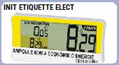

# Init. étiquettes électroniques 

<div className="contenaireImg">
    
    </div>

Si votre magasin est équipé d’étiquettes électroniques, vous pouvez initialiser ces étiquettes en appuyant sur ```INIT. ETIQUETTE ELECT.``` Les prix seront alors **mis à jour sur vos étiquettes**. 