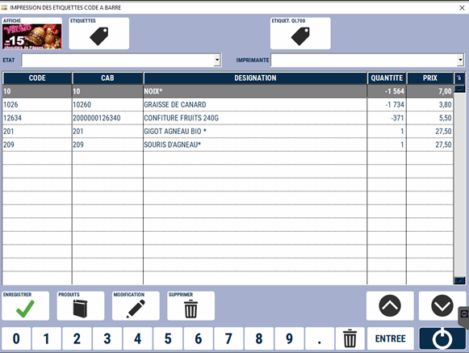
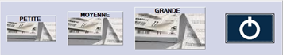

# Etiquettes produits

Pour chaque réception validée, S2Cash **enregistre automatiquement un nombre équivalent d’étiquettes** pour les produits dont le paramètre « étiquette » est activé dans la fiche produit.

Dans le cas de **modification du prix de vente** ou de **création de produit**, S2Cash enregistre automatiquement une étiquette.

<div className="contenaireImg">
    
    </div>

|Bouton |Action |
|:--:|------|
|  | **Ajouter un produit** à la liste. Vous pouvez également ajouter un produit en saisissant directement son code dans la colonne ```CODE```. |
|  | Accéder directement à la **fiche du produit** sélectionné en mode modification. |
|  | **Remplir le tableau des étiquettes** en récupérant les produits et les quantités depuis un **terminal de saisie** (si paramétrée). |
|  | Permet de **supprimer un produit de la liste**. ```Astuce``` : pour supprimer tous les produits de la liste, utilisez le raccourci clavier windows CTRL+A et cliquez sur supprimer. |
|  | Générer une **affiche** pour le produit sélectionné. |
|  |  Générer des étiquettes à destination d’une **planche à étiquettes au format A4 pour imprimante standard**. |
|  | Imprimer les étiquettes des produits sur une **imprimante à étiquettes BROTHER QL700**. |
|  | **Fermer la fenêtre en enregistrant les modifications** effectuées sur la liste des étiquettes en attente |

Lorsque vous cliquez sur ```ETIQUETTES```, vous pouvez choisir la taille souhaitée. 

<div className="contenaireImg">
    
    </div>