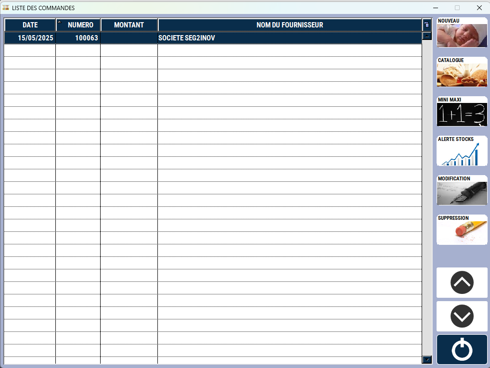
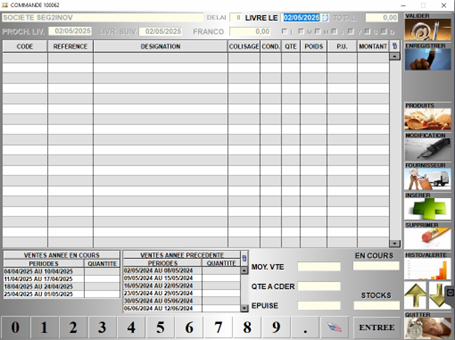
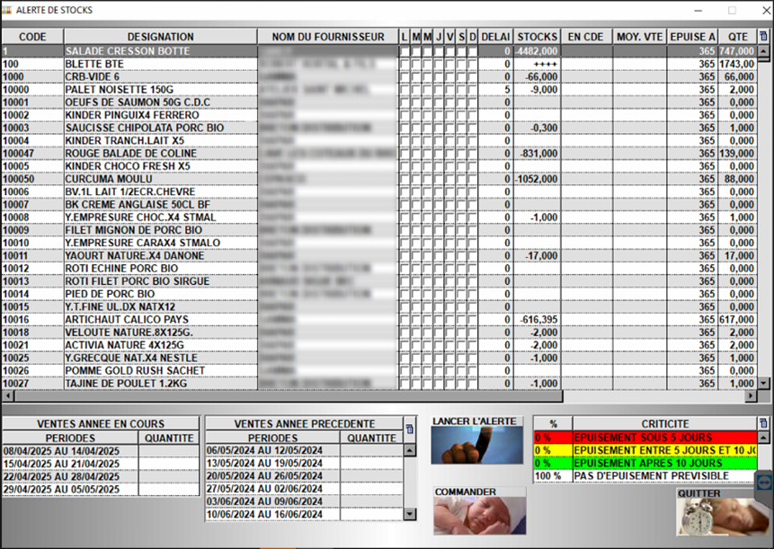
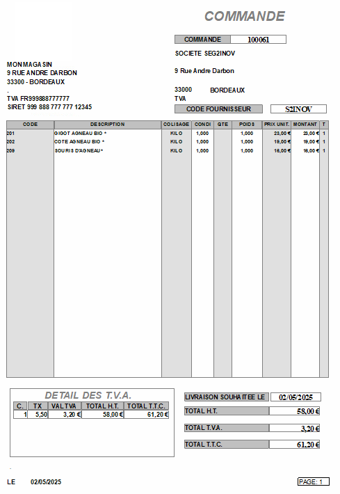

# Achat fournisseur

S2Cash vous permet de **saisir, éditer et envoyer vos commandes fournisseurs**. 

Il vous propose également une **aide à la décision** par l’affichage de l’historique des derniers mouvements et, plus largement, l’historique sur une période de référence antérieure.

:::tip
Vous pouvez **ouvrir une commande fournisseur** et **l’alimenter au fur et à mesure des besoins** jusqu’à ce que vous décidiez de la passer à votre fournisseur.
:::

Sur la page d'accueil s'affiche la liste des commandes en cours, qui n'ont pas encore été validées. 

<div className="contenaireImg">
    
    </div>

Vous pouvez :

|Bouton |Action |
|:--:|------|
|  | **Créer une nouvelle commande vierge**. |
|  | Créer une nouvelle commande **à partir d’un catalogue fournisseur**. |
|  | Générer une proposition de commande **en fonction des mini et maxi renseignés** sur les fiches produit. |
|  | **Suivre les prévisions d’épuisement des stocks** en fonction du stock, des dernières ventes et des ventes sur une période précédente, et d’établir des **propositions de commande par fournisseur**. | 
|  | Modifier la commande sélectionnée. | 
|  | Supprimer une commande en cours de saisie. |

## Créer une commande fournisseur

L’interface de création de commande se présente ainsi :

<div className="contenaireImg">
    
    </div>

## Saisir une commande fournisseur

Lors de la saisie de votre commande fournisseur, vous pouvez : 

|Bouton |Action |
|:--:|------|
|  | **Ajouter un produit** à la commande. Vous pouvez également ajouter un produit en saisissant directement son code dans la colonne ```CODE```. |
|  | Ouvrir la **fiche du produit sélectionné** en mode modification. |
|  | Accéder à la **fiche fournisseur**. |
|  | **Suivre les prévisions d’épuisement des stocks** en fonction du stock, des dernières ventes et des ventes sur une période précédente, et d’établir des **propositions de commande par fournisseur**. | 
|  | Consulter **l’historique du produit** et de voir les **alertes concernant les stocks**. | 
|  | **Insérer une ligne vide** dans la commande. Vous pouvez par exemple l’utiliser pour saisir un commentaire. |
|  | **Supprimer** un produit de la commande. |
|  |  **Valider la commande**. ```Attention``` : Cette opération est irréversible. Une fois validée, la commande disparait de la liste des achats fournisseur, et bascule dans le module « Réception fournisseur ». (INSERER UN LIEN VERS RECEPTION FOURNISSEUR) |
|  | **Enregistrer la commande sans la valider**, et ainsi pouvoir revenir dessus à tout moment. |

## Alerte de stocks

Le lancement de l’alerte de stocks permet la **génération des commandes pour les produits arrivés en limite de stocks** et qui vont **tomber en rupture**.

<div className="contenaireImg">
    
    </div>

<li> S2Cash calcule la **quantité moyenne de ventes par jour** en se référant aux ventes des 4 dernières semaines et des 6 semaines de l’année précédente par rapport à la date du jour. </li>

<li> En fonction du jour de commande fournisseur et de son délai moyen de livraison, S2Cash calcule le **besoin en stocks pour chacun des produits**. </li>

<li> En validant cette alerte, S2Cash génère les **pré commandes en attente de confirmation**. </li>

:::note
Lors de la **validation de la commande**, un mail est envoyé avec cette dernière si l’information de correspondance est **enregistrée sur la fiche Fournisseur**. 
:::

<div className="contenaireImg">
    
    </div>