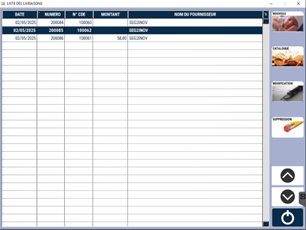
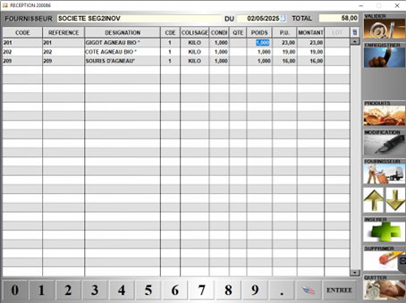
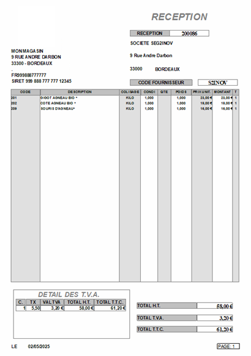

# Livraison fournisseur

Cette interface permet de **gérer et valider les réceptions de marchandises** et de **mettre à jour les stocks des produits**.

Lorsque vous validez une commande, elle est automatiquement basculée dans les **attentes de réception**.

Vous pouvez également **créer une nouvelle réception** directement ici, sans passer par l’interface de commande fournisseur.

Au lancement de la fenêtre, la **liste des réceptions en attente** apparait à l’écran.

<div className="contenaireImg">
    
    </div>

Vous pouvez alors : 
    
     Créer une nouvelle réception sans passer par l'interface de commande.
    
     Créer une nouvelle réception à partir d’un catalogue fournisseur.
    
     Modifier la livraison sélectionnée.

     Supprimer une livraison.


L’interface de gestion de la réception se présente ainsi :

<div className="contenaireImg">
    
    </div>

Il vous est alors possible de : 

|Bouton |Action |
|:--:|------|
|  | **Ajouter un produit** à la réception. Vous pouvez également ajouter un produit en saisissant directement son code dans la colonne ```CODE```. |
|  | Ouvrir la **fiche du produit** sélectionné en mode modification. |
|  | Accéder à la **fiche fournisseur**. |
|  | **Insérer une ligne vide** dans la réception. |
|  | **Supprimer** un produit de la réception. |
|  |  **Valider la réception**. ```Attention``` : Cette opération est irréversible et va générer une modification de vos stocks. |
|  | **Enregistrer la réception sans la valider**, et ainsi pouvoir revenir dessus à tout moment. |

<div className="contenaireImg">
    
    </div>