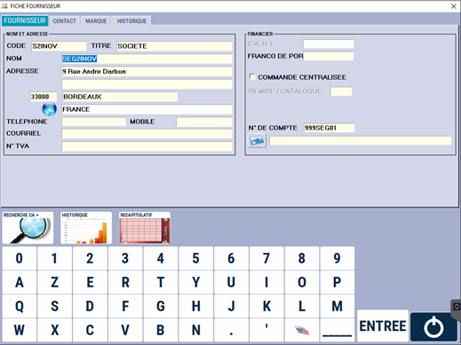

# Mise à jour des fournisseurs

Cette fenêtre vous permet de gérer vos fournisseurs.

Vous pouvez faire une recherche **par nom**, par **code fournisseur** ou **code postal**.

Il vous est possible de : 
    
     Afficher la **liste de tous les fournisseurs**.
    
     **Consulter** la fiche d'un fournisseur.
    
     **Modifier** la fiche d'un fournisseur.

     **Créer** un nouveau fournisseur.

 La fiche fournisseur se présente ainsi : 

 

    
    

:::warning
Il est important de renseigner correctement le **délai fournisseur** ainsi que les **jours de commande**, ce qui va optimiser au maximum les stocks et les commandes de réapprovisionnement au plus juste.
:::

La gestion des marques permet de **commander les produits aux fournisseurs par groupe de produits**.
