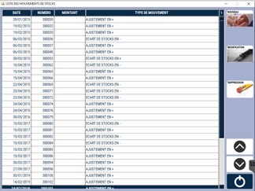
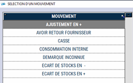
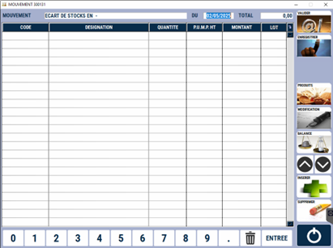

# Ajustement de stocks

Cette fenêtre permet de **saisir des mouvements de stock** autres que des ventes, des réceptions ou des transferts de stock.

Elle peut être utilisée pour **ajuster le stock**, **saisir de la casse** ou encore **gérer la consommation interne**. 

<div className="contenaireImg">
    
    </div>

    Pour créer un nouvel ajustement de stocks, appuyez sur ```NOUVEAU```.

    Pour modifier un ajustement de stocks en cours de préparation, appuyez sur ```MODIFICATION```.

    Pour supprimer un ajustement de stocks, pas encore validé, appuyez sur ```SUPPRESSION```.

## Créer un ajustement de stocks

Lorsque vous cliquez sur ```NOUVEAU```, une fenêtre vous invite à **sélectionner le type d’ajustement** que vous voulez effectuer. 

<div className="contenaireImg">
    
    </div>

:::tip
Cette liste est paramétrable via le menu MAJ DES MOUVEMENTS (insérer un lien vers MAJ des mouvements).
:::

Le tableau suivant apparait alors à l’ecran, vous pouvez commencer à **saisir le détail de votre ajustement**.

<div className="contenaireImg">
    
    </div>

## Saisir un ajustement de stocks

Lors de la saisie de votre ajustement, vous avez accès aux fonctions suivantes : 

|Bouton |Action |
|:--:|------|
|  | **Insérer une ligne vide**. |
|  | **Ajouter un produit**. Vous pouvez également ajouter un produit en saisissant directement son code dans la colonne ```CODE```. |
|  | **Ouvrir la fiche du produit sélectionné** en mode modification. |
|  | **Lire le ticket** d’une balance ou d’une caisse. | 
|  | **Supprimer** un produit. | 
|  | **Enregistrer l’ajustement sans le valider**, et ainsi pouvoir revenir dessus à tout moment. |
|  | **Valider** l'enregistrement. ```Attention``` : cette opération est irréversible. 

