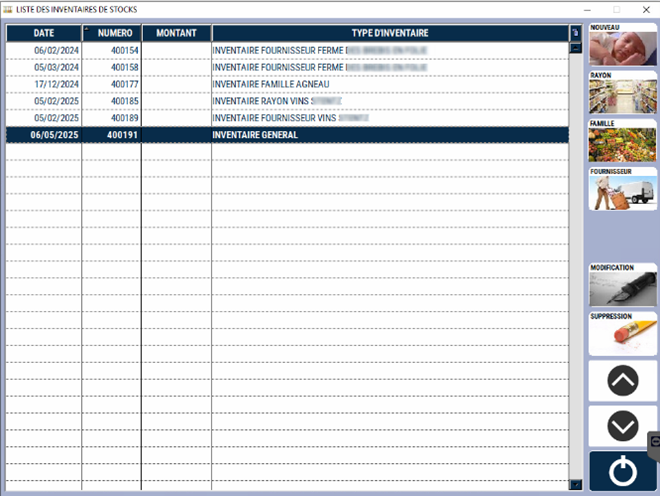
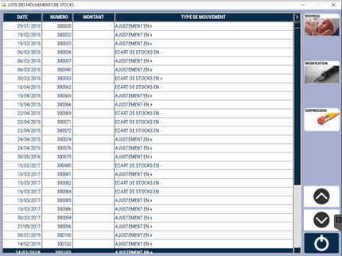
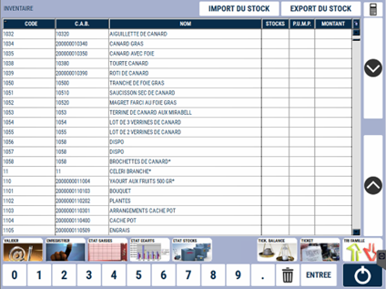
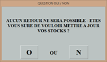

# Inventaire des stocks

Cette option permet d’effectuer vos **inventaires partiels ou en totalité**.

Lorsque vous créez un inventaire, un **gel du stock est effectué** (image du stock à l’instant T) et permettra une mise à jour en décalé des stocks lors de la validation.

:::warning
Il ne doit pas y avoir de ventes entre le moment où l’inventaire est généré et le moment où le comptage est effectué.
:::

Dès lors que la comptabilisation des produits est faite, les ventes peuvent reprendre.

La mise à jour des stocks se fera en appliquant les écarts du stock sur chaque produit.

## Créer l'inventaire

A l’ouverture de la fenêtre, la liste des inventaires en cours apparait.

<div className="contenaireImg">
    
    </div>

Vous pouvez alors : 

|Bouton |Action |
|:--:|------|
|  | Générer un nouvel inventaire **avec la totalité des produits**. |
|  | Générer un nouvel inventaire **avec les produits d’un fournisseur**. |
|  | Générer un nouvel inventaire **avec les produits d’une famille**. |
|  | Générer un nouvel inventaire **avec les produits d’un rayon**. |
|  | **Modifier** un inventaire en cours. |
|  | **Supprimer** un inventaire tant que celui-ci n’est pas validé. |

Une fois dans l’inventaire, il vous faut **renseigner la colonne stock réel correspondant à votre comptage**.

<div className="contenaireImg">
    
    </div>

:::note
Selon le paramétrage, **la colonne PUMP peut être modifiée**.

Pour rappel, le PUMP est le **Prix Unitaire Moyen Pondéré**, aussi appelé parfois CUMP pour Coût Unitaire Moyen Pondéré. Cette valeur correspond à la **moyenne des prix d’achats d’un produit**, pour peu que les réceptions soient toutes saisies et validées. 
:::

:::tip
**Méthode de calcul du PUMP** : (valeur stock initial + valeur entrée) / (quantité stock initial + quantité entrée). 
:::

## Saisir l'inventaire

<div className="contenaireImg">
    
    </div>

Sur la page de saisie de votre inventaire, vous pouvez : 

|Bouton |Action |
|:--:|------|
|  | **Imprimer** une liste de vos produits sous forme de tableau afin de pouvoir saisir votre **inventaire sur papier**. | 
|  | Trier les produits **par famille**. |
|  | Afficher un document indiquant **l’écart de stock** qui va être appliqué au moment de la validation de l’inventaire. | 
|  | Imprimer un **état des stocks**. |
|  | Lire le **ticket d’une caisse**. | 
|  | Lire le **ticket d’une balance**. |
|  | **Valider** l’inventaire. ```Attention``` : cette opération est irréversible et va appliquer un mouvement sur votre stock. |
|  | **Enregistrer votre travail** sur l’inventaire en cours et revenir dessus à tout moment. Ceci n’impacte pas votre stock. |

:::note
Il est possible d’imprimer un **état de saisie préparatoire** pour écrire les quantités par produit.
:::

## Valider l'inventaire

A la validation, **un état de la saisie et des écarts est généré**. Les stocks sont mis à jour par différence et enregistrés dans vos historiques.

Une **alerte pour contrôle est affichée à l’écran**. 

<div className="contenaireImg">
    
    </div>

Enfin, l’état des stocks est envoyé en centrale pour **synchronisation**.

<div className="contenaireImg">
    
    </div>