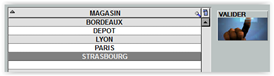

# Transfert de stocks

Cette interface permet de **créer le transfert des produits vers ou depuis un autre magasin**.

Au lancement de la fenêtre, la liste des transferts en cours apparait.

<div className="contenaireImg">
    
    </div>

Vous pouvez alors : 

    Créer un nouveau transfert de stocks.

    Modifier un ajustement de stocks en cours de préparation.

    Supprimer un transfert de stocks, tant qu'il n'est pas validé.

## Créer un transfert de stocks

Lors de la création d’un nouveau transfert, la liste des magasins apparait. **Sélectionnez le magasin avec lequel vous allez agir** et cliquez sur ```VALIDER```.

<div className="contenaireImg">
    
    </div>

Une fenêtre apparait : « Envoyez-vous les produits vers l’autre site ? »

<div className="contenaireImg">
    
    </div>

```OUI``` : Vous envoyez les produits vers le magasin sélectionné, ces derniers seront **retirés de votre stock**.

```NON``` : C’est le magasin sélectionné qui vous a envoyé les produits, ils seront donc **ajoutés à votre stock**.

## Saisir un transfert de stocks

Après avoir répondu à la question précédente, le tableau de saisie du transfert apparaît.

<div className="contenaireImg">
    
    </div>

|Bouton |Action |
|:--:|------|
|  | **Insérer une ligne vide**. |
|  | **Ajouter un produit**. Vous pouvez également ajouter un produit en saisissant directement son code dans la colonne ```CODE```. |
|  | **Ouvrir la fiche du produit sélectionné** en mode modification. |
|  | Renseigner votre transfert de stock à l’aide d’un **terminal de saisie** (si paramétré). | 
|  | **Lire de ticket** d'une caisse ou d'une balance. | 
|  | **Supprimer** un produit. | 
|  | **Enregistrer l’ajustement sans le valider**, et ainsi pouvoir revenir dessus à tout moment. |
|  | **Valider** l'enregistrement. ```Attention``` : cette opération est irréversible. 
