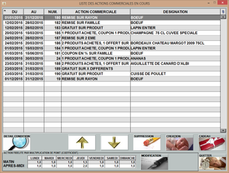
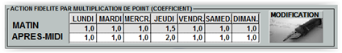
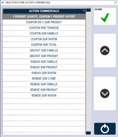
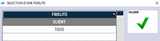
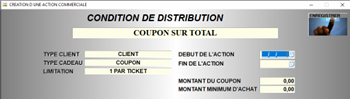
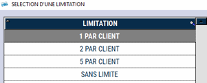

# Actions commerciales

S2Cash vous propose une **multitude d’actions commerciales programmables en avance**.

A l’ouverture de la fenêtre, la liste de toutes les actions commerciales en cours apparaît.

<div className="contenaireImg">
    
    </div>

Sur l'écran d'accueil, vous pouvez : 

        Créer une nouvelle action commerciale. 

        Supprimer une action commerciale. 

        Gérer la base de produits cadeaux, obtenus par le client lorsqu’un seuil de points est atteint.

        Faire passer le tableau en mode modification. 


## Fidélité

Le tableau en bas de l'écran vous permet de **gérer la fidélité par point** avec une **valorisation variable en demi-journée sur la semaine**.

Dans l’exemple ci-dessous, le nombre de points acquis le jeudi après-midi est multiplié par 2.

<div className="contenaireImg">
    
    </div>

:::warning
<li> Les actions commerciales sont cumulables entre elles. </li> 
<li> Si le client sélectionné lors de la vente bénéficie d’une **remise automatique**, celle-ci est prioritaire et ne se cumule pas avec une action commerciale. </li> 
<li> Si vous faites une **remise sur total**, celle-ci est prioritaire et ne se cumule pas avec une action commerciale. </li> 
<li> Si le client veut utiliser sa **remise fidélité**, celle-ci est prioritaire et ne se cumule pas avec une action commerciale. </li> 
:::

## Créer une action commerciale

Lorsque vous cliquez sur ```CREATION```, la fenêtre de sélection du type d’action apparait.

<div className="contenaireImg">
    
    </div>

Sélectionnez l’action commerciale voulue et validez.

Vous avez le choix parmi les différentes actions commerciales basées sur 4 types différents :

1/ LE COUPONING

2/ LE GRATUIT

3/ LE RABAIS

4/ LA REMISE

Choisissez si l’action doit être effectuée **uniquement sur les clients référencés dans votre base client** ou sur **tous les clients de votre magasin**. 

<div className="contenaireImg">
    
    </div>

### Le couponing 

Cela permet de **générer un coupon** que le client pourra utiliser ultérieurement **en guise de moyen de règlement**. 

Vous pouvez choisir la **période de validité des coupons**. 

<div className="contenaireImg">
    
    </div>

|Type de coupon |Fonction |
|:---------------:|---------|
| COUPON EN % SUR FAMILLE |Génère un coupon d’un **montant variable** selon un **pourcentage défini sur le total des ventes des produits d’une famille**. |
| COUPON EN % SUR RAYON |Génère un coupon d’un **montant variable** selon un **pourcentage défini sur le total des ventes des produits d’un rayon**. |
| COUPON PAR TRANCHE |Génère autant de coupons de **montant fixe** que de **tranches de chiffre d’affaire dépassées**.|
| COUPON SUR FAMILLE |Génère un coupon d’un **montant fixe** si le total des ventes des **produits d’une famille atteint un palier défini**. |
| COUPON SUR RAYON |Génère un coupon d’un **montant fixe** si le total des ventes des **produits d’un rayon atteint un palier défini**. |
| COUPON SUR TOTAL |Génère un coupon d’un **montant fixe** si le **total du panier atteint un palier défini**. |
| COUPON OFFERT |Génère un **coupon de gratuité pour un produit acheté**. |

### Le gratuit

Permet d'offrir un ou plusieurs produits sur le panier.

Lors de la création de ce type d’action commerciale, vous êtes invité à **saisir la limite du nombre de produits offerts**.

<div className="contenaireImg">
    
    </div>

|Type de gratuité |Fonction |
|:---------------:|---------|
| GRATUIT SUR FAMILLE |Pour l’achat d’un nombre défini de **produits d’une même famille**, offre une quantité définie **d’autres produits de la même famille**.|
| GRATUIT SUR PRODUIT |Pour l’achat d’une quantité définie **d’un même produit**, offre une quantité définie **de ce même produit**. |
| GRATUIT SUR X DIFFERENTS |Pour l’achat d’une quantité définie de produits d’une **liste de produits choisis**, offre un ou plusieurs produits dans une **liste de cadeaux définie**.|
| GRATUIT SUR COMPTE |Pour l’achat de **deux produits**, offre **la valeur d’un produit sur le compte du client**. |

### Le rabais

Permet d'effectuer un rabais sur le montant total du panier.

|Type de rabais |Fonction |
|:---------------:|---------|
| RABAIS SUR FAMILLE |Effectue un **rabais d’un montant fixe** si le total des ventes des **produits d’une famille** atteint un palier défini. |
| RABAIS SUR PRODUIT |Effectue un **rabais d’un montant fixe** si le total des ventes **d’un produit** atteint un palier défini. |
| RABAIS SUR RAYON |Effectue un **rabais d’un montant fixe** si le total des ventes des **produits d’un rayon** atteint un palier défini. |

### La remise

Permet d'effectuer une remise sur le total d’un panier.

|Type de remise |Fonction |
|:---------------:|---------|
| REMISE SUR 2EME |Effectue une **remise en pourcentage sur le second produit** d’une liste de produits choisis.|
| REMISE SUR PRODUIT |Effectue une **remise en pourcentage sur le montant des ventes d’une famille** si celui-ci dépasse un palier défini.|
| REMISE SUR FAMILLE |Effectue une **remise en pourcentage sur le montant des ventes d’un produit** si celui-ci dépasse un palier défini.|
| REMISE SUR RAYON |Effectue une **remise en pourcentage sur le montant des ventes d’un rayon** si celui-ci dépasse un palier défini.|

## Conditions de reprise 

|Vous pouvez définir les conditions de reprise d'un coupon |Ces différents contrôles et limites seront effectués par le système de caisse |
|:---------------:|---------|
| ||
