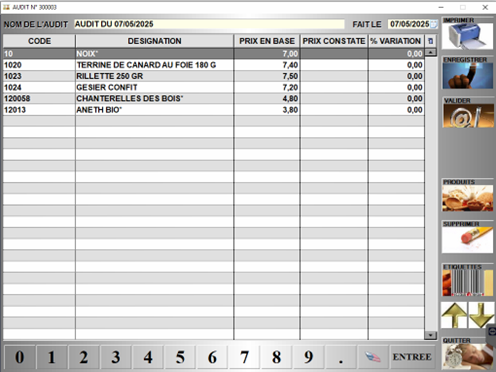
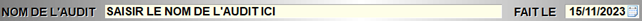

# Contrôle des prix

Cette fonctionnalité permet de réaliser un **audit de prix**, c’est-à-dire d’imprimer un **listing de produits avec leur prix** afin d’éventuellement les comparer avec ceux de la concurrence. 

Pour créer un nouvel audit, appuyer sur ```NOUVEAU```. Cette page s’ouvre alors :

<div className="contenaireImg">
    
    </div>

Vous pouvez **nommer et dater** le contrôle de prix.

<div className="contenaireImg">
    
    </div>

 |Bouton |Action |
    |:--:|------|
    |  | Sélectionner les produits choisis. |
    |  | Supprimer un produit. |
    |  | Enregistrer la liste afin de la compléter plus tard. |
    |  | Valider l'audit. |
    |  |Imprimer l'audit. |
    |  | Editer des étiquettes pour les produits choisis. |