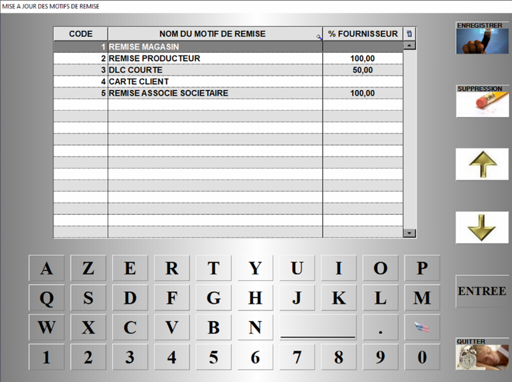

# Mise à jour des motifs de remise

Cette fenêtre vous permet de gérer les motifs de remise.

    
    

<li> Saisissez un **code disponible** en suivant ceux déjà en place, </li>
<li> Attribuez un **nom** à ce motif de remise, </li>
<li> Renseignez éventuellement le **pourcentage de la remise** qui sera impacté au fournisseur (sur ETATS DE RETROCESSION). </li>

:::note
Vous pouvez **enregistrer les modifications**, ou **supprimer un enregistrement**. 
:::
