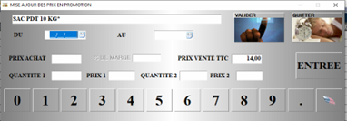
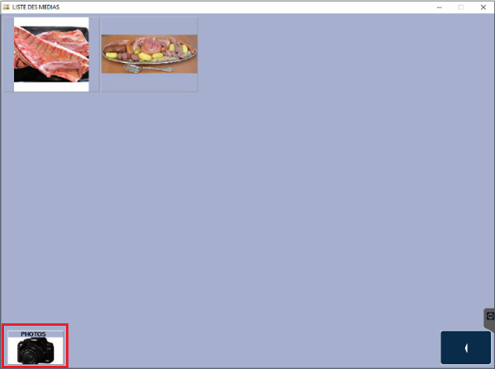

# Suivi des promotions

Cette fonction vous permet de **préparer vos promotions** et **changements de prix à l’avance**.

## Créer une promotion

Pour créer une nouvelle promotion, appuyez sur ```NOUVEAU```, puis **sélectionnez le produit concerné**. 

La fenêtre de création de la promotion apparait : 

<div className="contenaireImg">
    
    </div>

Renseignez : 
<li> Une date de début </li>
<li> Une date de fin </li>
<li> Le prix de vente promotion </li>
<li> Eventuellement des prix dégressifs </li>

:::note
Si aucune date de fin n’est renseignée, un changement de prix sera appliqué **à partir de la date de début**.
:::

|Bouton |Action |
|:----:|----------|
|  |Ce bouton permet un **accès direct à la fiche du produit sélectionné**. |
|  |Ce bouton permet de **générer une affiche** pour le produit sélectionné avec le **prix promotion**. |
|  |Vous pouvez à tout moment **supprimer une promotion**. |
|  |Ce bouton permet de **générer une affiche pour le produit** et de **l’ajouter aux médias** (images qui défilent sur l’écran côté client). |
|  |Cliquez sur ce bouton pour **accéder à l’interface de gestion des médias**. |

## Gestion des médias

Pour **ajouter un média à partir d’un fichier image**, cliquer sur le bouton ```PHOTOS``` et sélectionnez votre image.     

<div className="contenaireImg">
    
    </div>

Pour **supprimer un média**, il vous suffit de cliquer dessus. 