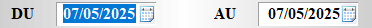

# Contrôle des ventes

Cette fonctionnalité permet de voir s’il y a un **écart dans les tickets**, c’est-à-dire entre l’en-tête d’un ticket et son détail. 

Vous pouvez **sélectionner la date ou la période** pour laquelle vous souhaitez faire la recherche. La liste des tickets contenant un écart s’affiche. 

    
    

