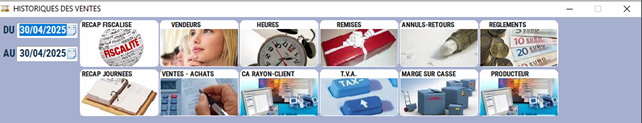
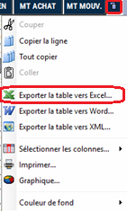

# Hit parade des ventes

Cette option regroupe toutes les **statistiques nécessaires au bon suivi de votre point de vente**.

Déterminez les dates de début et de fin de la période recherchée, et cliquez sur l’analyse que vous souhaitez afficher :

    
    

    Pour chaque analyse, S2Cash affiche les données par ligne et un récapitulatif en bas d’écran pour la totalité des informations sur la période sélectionnée.

    |Bouton |Action |
    |:--:|------|
    |  |Récapitulatif du chiffre d’affaires **par jour**. | 
    |  | Récapitulatif du chiffre d'affaires **par tranche horaire**. |
    |  |Récapitulatif du chiffre d’affaires réalisé **par vendeur**. |
    |  |Liste des **remises** et des **actions commerciales**. |
    |  |Liste des **annulations** et des **retours**. |
    |  | Récapitulatif du chiffre d’affaires **par moyen de paiement**. |
    |  |Liste **des ventes et des achats** par produit, rayon, famille ou fournisseur. |
    |  | Récapitulatif du **chiffre d’affaires**, **nombre de clients** et **panier moyen par rayon**. |
    |  |**Déclaration de la TVA** par jour ou par rayon. |
    |  | Détail de la **marge sur la casse** pour chaque produit. |
    |  |Détail des **remises produit par producteur**. |

    À tout moment, vous pouvez : 

        Obtenir le détail de la ligne sélectionnée. 

        Imprimer les informations. 

    :::tip
    Comme dans tous les tableaux générés par S2Cash, vous avez la possibilité **d’exporter les données directement vers Excel**, en faisant un clic sur le bord supérieur droit du tableau.
    :::

    
    

