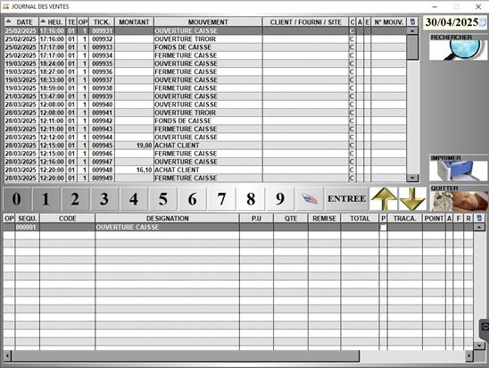

# Journal des ventes 

S2Cash enregistre **tous les mouvements de vente et de gestion dans un journal électronique** qui pourra être utilisé comme **pièce justificative lors de contrôle** comptable – financier – juridique – fiscal. 

Saisissez la date recherchée et lancez le traitement par la touche ```RECHERCHE```.

    <div className="contenaireImg">
    
    </div>

La partie basse de l’écran affiche le détail de la ligne du mouvement sur laquelle vous êtes positionné.

|Bouton |Action |
|:----:|----------|
|  |S’il s’agit d’une vente, vous pouvez **consulter la fiche du produit** sur lequel vous êtes positionné. |
|  |S’il s’agit d’une action rattachée à un client, vous pouvez **consulter la fiche du client** concerné. |
|  |S’il s’agit d’une action rattachée à un fournisseur, vous pouvez **consulter la fiche du fournisseur** concerné. |
|  |Vous pouvez **imprimer le journal en totalité**. |